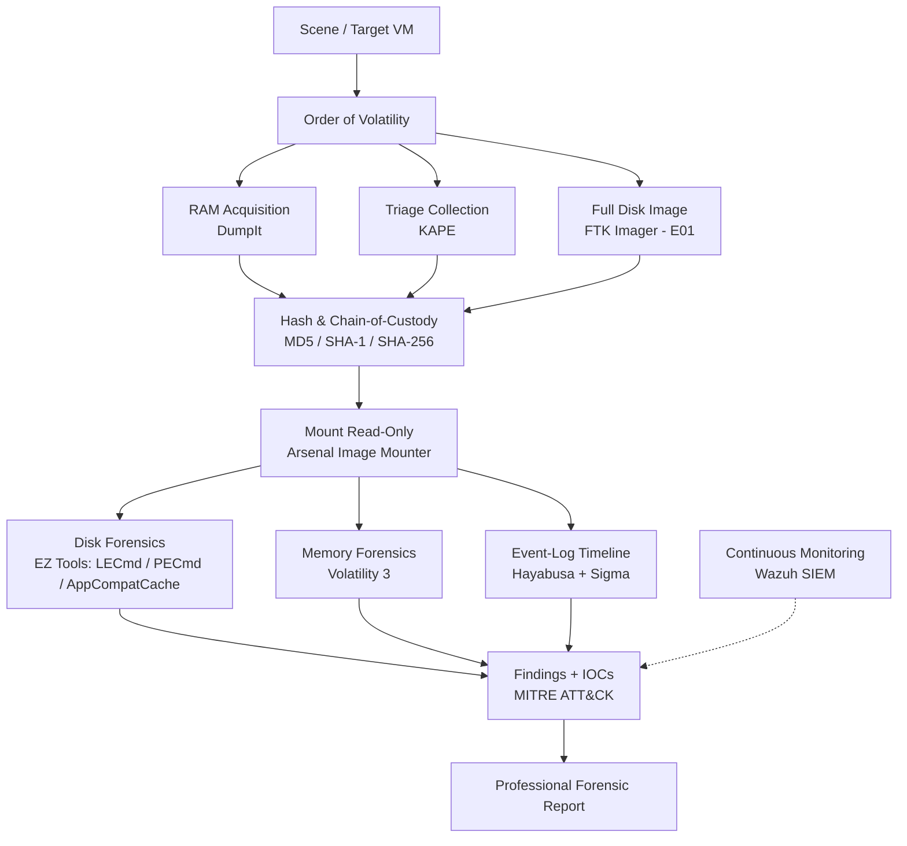

# Digital Forensics & Incident Response (DFIR) — Internship Portfolio

> Hands-on DFIR casework from my internship at the **Agence Nationale de la Cybersécurité (ANC) / DJ-CERT**, Republic of Djibouti — evidence acquisition, disk & memory forensics, malware triage, event-log timelining, and SIEM deployment, all performed in an isolated training lab.

**Author:** Kassim Galeb Mahamoud
**Host organisation:** Agence Nationale de la Cybersécurité (ANC) / DJ-CERT
**Field:** Cybersecurity — Digital Forensics & Incident Response
**Environment:** Sandboxed training laboratory (virtual machines) — *no live incidents or production data*

---

## Table of Contents

1. [Overview](#overview)
2. [Investigation & Acquisition Flow](#investigation--acquisition-flow)
3. [What's in this repository](#whats-in-this-repository)
4. [Case 1 — Jimmy Wilson Disk Forensics](#case-1--jimmy-wilson-disk-forensics)
5. [Case 2 — Maryam Acquisition & Chain-of-Custody](#case-2--maryam-acquisition--chain-of-custody)
6. [Case 3 — Malware Triage (Volatility 3)](#case-3--malware-triage-volatility-3)
7. [Case 4 — Hayabusa Event-Log Timeline](#case-4--hayabusa-event-log-timeline)
8. [Case 5 — Wazuh SIEM Deployment](#case-5--wazuh-siem-deployment)
9. [Evidence Integrity (Hashes)](#evidence-integrity-hashes)
10. [Skills Demonstrated](#skills-demonstrated)
11. [Ethics, Safety & Usage](#ethics-safety--usage)

---

## Overview

This portfolio documents the professional experience I gained during my DFIR internship at Djibouti's national cybersecurity authority. Across five distinct exercises I practised the full incident-response lifecycle — **acquisition → preservation → examination → analysis → reporting** — using industry-standard tooling and a repeatable, defensible methodology. Every activity was performed on training systems, practice datasets, and virtual machines in an isolated lab.

| At a glance | |
|---|---|
| **Cases completed** | 5 (2 full forensic investigations + malware triage + timelining + SIEM build) |
| **Evidence types** | E01 disk images, RAM dumps, KAPE triage sets (1,003+ artefacts), event logs |
| **Core tools** | Volatility 3, KAPE, FTK Imager, DumpIt, Eric Zimmerman Tools, Hayabusa, Wazuh, Arsenal Image Mounter |
| **Methodology** | Adapted 17-phase DFIR workflow ([full detail](METHODOLOGY_17_PHASES.md)) |
| **Frameworks** | MITRE ATT&CK mapping, chain-of-custody, cryptographic hash verification |

---

## Investigation & Acquisition Flow

---

## What's in this repository

| File | Description |
|---|---|
| [`README.md`](README.md) | This overview |
| [`01_JIMMY_WILSON_CASE.md`](01_JIMMY_WILSON_CASE.md) | Full disk-forensics investigation (identity-theft scenario) |
| [`02_MARYAM_ACQUISITION_CASE.md`](02_MARYAM_ACQUISITION_CASE.md) | Evidence acquisition + chain-of-custody exercise |
| [`03_MALWARE_TRIAGE.md`](03_MALWARE_TRIAGE.md) | Static/dynamic malware triage with Volatility 3 |
| [`04_HAYABUSA_TIMELINE.md`](04_HAYABUSA_TIMELINE.md) | Sigma-based event-log timeline analysis |
| [`05_WAZUH_SIEM_DEPLOYMENT.md`](05_WAZUH_SIEM_DEPLOYMENT.md) | End-to-end Wazuh SIEM build & agent onboarding |
| [`METHODOLOGY_17_PHASES.md`](METHODOLOGY_17_PHASES.md) | The adapted 17-phase DFIR methodology |
| [`CHAIN_OF_CUSTODY.md`](CHAIN_OF_CUSTODY.md) | Evidence inventory, hashes, and custody notes |
| [`TOOLS.md`](TOOLS.md) | Tool reference and representative command index |
| [`IOCs.csv`](IOCs.csv) | Machine-readable indicators of compromise |
| [`DFIR_Internship_Report_Kassim_Galeb.docx`](DFIR_Internship_Report_Kassim_Galeb.docx) | The complete formatted internship report |

---

## Case 1 — Jimmy Wilson Disk Forensics

A read-only examination of an **E01 disk image** attributed to suspect *Jimmy Wilson*, establishing an active identity-theft and document-fraud operation across nine examination phases (LNK, Prefetch, ShimCache, browser history, document metadata).

**Highlights:** victim PII spreadsheet (4 victims, full name/DOB/SSN); BCTextEncoder-encrypted communications about co-conspirators; browser searches for *"how to steal identities"*; research into Zebra ID-card printers; TrueCrypt volumes in active use; deliberate deletion of a "New Prices" folder (anti-forensics). → [Read the full write-up](01_JIMMY_WILSON_CASE.md)

## Case 2 — Maryam Acquisition & Chain-of-Custody

A structured acquisition exercise on host **DESKTOP-2Q2EPKM** (user `maryam.var`), following the order of volatility: RAM dump (DumpIt) → KAPE triage → full E01 disk image (FTK Imager) → hash verification. Triage surfaced Defender detections for a commercial keylogger, downloaded trojans, an AutoKMS hacktool with service/scheduled-task persistence, Defender-tampering, and a DLL injector. → [Read the full write-up](02_MARYAM_ACQUISITION_CASE.md)

## Case 3 — Malware Triage (Volatility 3)

Memory-based extraction and static/dynamic triage of malware samples recovered from the Maryam host, mapped to MITRE ATT&CK. → [Read the full write-up](03_MALWARE_TRIAGE.md)

## Case 4 — Hayabusa Event-Log Timeline

Processing collected Windows event logs with **Hayabusa** (Yamato Security) to build a Sigma-rule-based detection timeline, using the Core+ rule set for the best DFIR signal-to-noise ratio. → [Read the full write-up](04_HAYABUSA_TIMELINE.md)

## Case 5 — Wazuh SIEM Deployment

Deploying a centralized **Wazuh** SIEM on a VPS, onboarding a Windows agent, and verifying end-to-end log/alert flow in the dashboard. → [Read the full write-up](05_WAZUH_SIEM_DEPLOYMENT.md)

---

## Evidence Integrity (Hashes)

| Evidence | Algorithm | Value | Status |
|---|---|---|---|
| E-01 (memory) | SHA-256 | `7c93c1a808c4cc8021ae95e1526495ff4d38da0d82d5d2adbd808e646d60996c` | Recorded |
| E-02 (disk) | MD5 | `74313aabb222d81b9eec44a6e0199b6f` | MATCH |
| E-02 (disk) | SHA-1 | `e871c8e1abe694c00f0565c3eeffd4de30b3b122` | MATCH |

Full inventory in [`CHAIN_OF_CUSTODY.md`](CHAIN_OF_CUSTODY.md).

---

## Skills Demonstrated

- **Forensic acquisition** — memory (DumpIt), triage (KAPE), and full-disk (FTK Imager, E01) capture following order of volatility.
- **Evidence integrity** — MD5/SHA-1/SHA-256 hashing, read-only mounting, documented chain of custody.
- **Disk forensics** — LNK, Prefetch, ShimCache/AppCompatCache, MFT, and browser artefact analysis with Eric Zimmerman Tools.
- **Memory forensics** — process, network, injection, and persistence analysis with Volatility 3.
- **Malware triage** — static (strings, PE, YARA, capa) and dynamic (sandbox) analysis; MITRE ATT&CK mapping.
- **Detection engineering** — Sigma-based event-log timelining with Hayabusa.
- **Blue-team operations** — Wazuh SIEM deployment, agent onboarding, and alert monitoring.
- **Professional reporting** — defensible findings, IOC extraction, timelines, and recommendations.

---

## Ethics, Safety & Usage

All work was conducted in an **isolated, sandboxed training laboratory** on practice datasets and virtual machines — never on live incidents, real victims, or production systems. Case names and personas (e.g., "Jimmy Wilson", "Maryam") are training scenarios. No malware samples are distributed in this repository; only indicators, classifications, and methodology are documented for educational and portfolio purposes.

**License:** [MIT](LICENSE) — documentation and analysis.
**Credit:** Internship hosted by the Agence Nationale de la Cybersécurité (ANC) / DJ-CERT, Republic of Djibouti.
